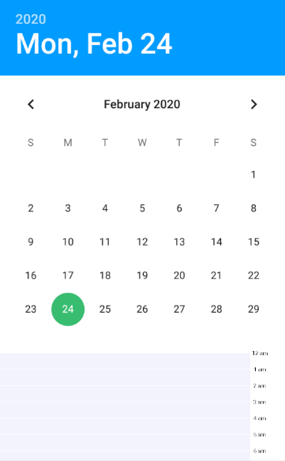
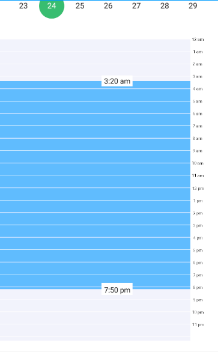

# Vertical Time Range Picker

Vertical time Range picker is a unique Time picker with Date Picker.

## Android UI

Date Picker Xml

            android:id="@+id/datePicker"
            android:layout_gravity="center"
            android:layout_marginTop="42dp"
            android:headerBackground="@color/colorBlue"
            android:layout_width="wrap_content"
            android:layout_height="match_parent"
            android:layout_alignParentTop="true"
            android:layout_centerHorizontal="true"
            android:scaleX="1.2"
            android:scaleY="1.2"
            android:layout_marginBottom="20dp"
            android:datePickerMode="calendar"
        

Time Range Picker Xml

 

## Usage

The following snippet shows how you can use Vertical Time Range Picker in your project.
