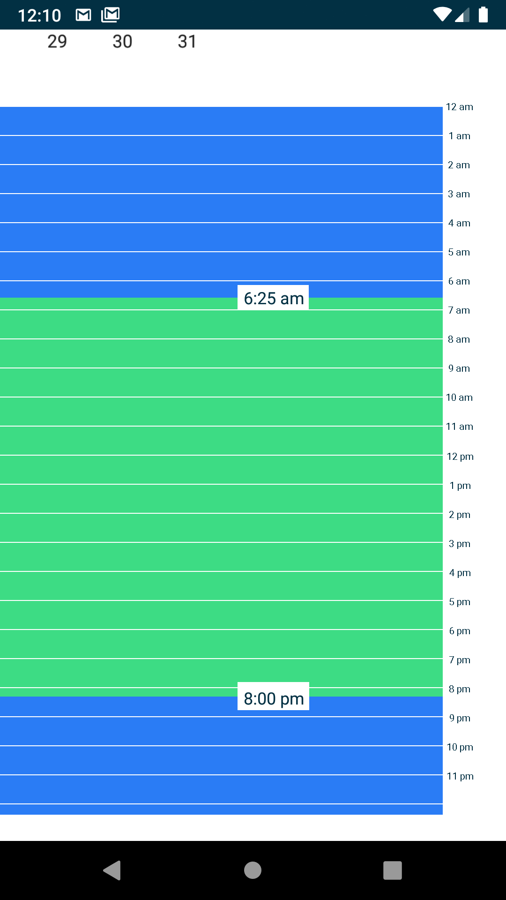

# Vertical Time Range Picker

Vertical time Range picker is a unique Time picker with Date Picker.

## Android UI

Date Picker Xml

            <DatePicker
            android:id="@+id/datePicker"
            android:layout_gravity="center"
            android:layout_marginTop="42dp"
            android:headerBackground="@color/colorBlue"
            android:layout_width="wrap_content"
            android:layout_height="match_parent"
            android:layout_alignParentTop="true"
            android:layout_centerHorizontal="true"
            android:scaleX="1.2"
            android:scaleY="1.2"
            android:layout_marginBottom="20dp"
            android:datePickerMode="calendar" />
        

Time Range Picker Xml

            <com.example.verticalrangeseekbar.widget.VerticalRangeSeekBar
            android:id="@+id/timeRange"
            android:layout_width="380dp"
            android:layout_height="match_parent"
            android:paddingLeft="3dp"
            android:paddingRight="1dp"
            android:layout_marginBottom="30dp"
            app:rsb_indicator_background_color="#fff"
            app:rsb_indicator_height="60dp"
            app:rsb_indicator_padding_bottom="8dp"
            app:rsb_indicator_padding_left="8dp"
            app:rsb_indicator_padding_right="8dp"
            app:rsb_indicator_padding_top="8dp"
            app:rsb_indicator_show_mode="alwaysShowAfterTouch"
            app:rsb_indicator_text_color="@color/colorAccent"
            app:rsb_indicator_text_size="14sp"
            app:rsb_indicator_width="wrap_content"
            app:rsb_max="36.01"
            app:rsb_min="12"
            app:rsb_mode="range"
            app:rsb_orientation="right"
            app:rsb_progress_drawable="@drawable/foreground"
            app:rsb_progress_drawable_default="@drawable/background"
            app:rsb_progress_height="380dp"
            app:rsb_step_auto_bonding="false"
            app:rsb_step_color="#fff"
            app:rsb_step_height="380dp"
            app:rsb_step_width="0.7dp"
            app:rsb_steps="24"
            app:rsb_thumb_width="0dp"
            app:rsb_tick_mark_mode="other"
            app:rsb_tick_mark_number="24"
            app:rsb_tick_mark_text_array="@array/markArray"
            app:rsb_tick_mark_text_color="#000"
            app:rsb_tick_mark_text_margin="10dp"
            app:rsb_tick_mark_text_size="8sp" />
 

## Implementation

Add it in your root build.gradle at the end of repositories:

	allprojects {
		repositories {
			...
			maven { url 'https://jitpack.io' }
		}
	}
            
 Add the dependency

	dependencies {
	        implementation 'com.github.farhanfahim:VerticalTimeRangeSeekBar:1.0'
	}  
            
## Usage

The following snippet shows how you can use Vertical Time Range Picker in your project.

### In Java

Step #1

        VerticalRangeSeekBar timeRange;
        DatePicker datePicker;
        VerticalTimeRangePicker verticalTimeRangePicker;
            
        timeRange = findViewById(R.id.timeRange);
        datePicker = findViewById(R.id.datePicker);

Step #2

        verticalTimeRangePicker = new VerticalTimeRangePicker(timeRange, datePicker, MainActivity.this);

        verticalTimeRangePicker.timeRangeInit(timeRange);
        verticalTimeRangePicker.datePickerInit(datePicker);
        verticalTimeRangePicker.dateChanged();
        
Step #3

        onChangeListener=========================

        timeRange.setOnRangeChangedListener(new OnRangeChangedListener() {
            @Override
            public void onRangeChanged(RangeSeekBar view, float leftValue, float rightValue, boolean isFromUser) {
                verticalTimeRangePicker.onRangeChangedValue(leftValue, rightValue);
            }

            @Override
            public void onStartTrackingTouch(RangeSeekBar view, boolean isLeft) {
            }

            @Override
            public void onStopTrackingTouch(RangeSeekBar view, boolean isLeft) {
            }
        });
        
        
Step #4

        callbacks=========================

        verticalTimeRangePicker.getDate();
        verticalTimeRangePicker.getStartHour();
        verticalTimeRangePicker.getEndHour();
        verticalTimeRangePicker.getStartMinutes();
        verticalTimeRangePicker.getEndMinutes();
